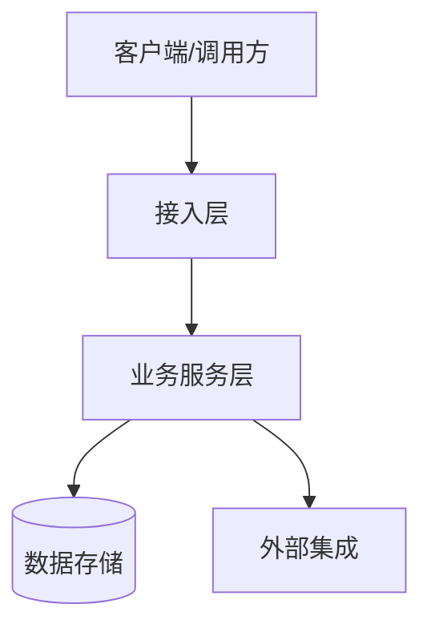

# 总体技术架构

> 本文件描述项目级、跨产品与跨特性的技术架构，是所有 Design 文档的共同技术基线。具体功能的实现方案在 `04-design/` 中维护；若局部设计偏离本文件，必须记录原因、影响和后续处理方式。

- 状态：草稿
- 负责人：待填写
- 创建日期：YYYY-MM-DD
- 最后更新：YYYY-MM-DD

## 架构目标

- 业务目标：待填写
- 技术目标：待填写
- 关键质量属性：待填写（如可用性、性能、安全性、可维护性和成本）
- 明确不解决的问题：待填写

## 系统上下文

描述系统边界、用户、外部系统和主要交互。按项目实际情况替换下图。

## 架构原则与约束

| 类别 | 原则/约束 | 原因 | 影响 |
|---|---|---|---|
| 技术原则 | 待填写 | 待填写 | 待填写 |
| 业务约束 | 待填写 | 待填写 | 待填写 |
| 合规与安全 | 待填写 | 待填写 | 待填写 |
| 成本与资源 | 待填写 | 待填写 | 待填写 |

## 总体架构

描述系统分层、核心组件、职责边界和依赖方向。按项目实际情况替换下图。

### 核心组件

| 组件/模块 | 核心职责 | 技术选型 | 依赖 | 所有者 |
|---|---|---|---|---|
| 待填写 | 待填写 | 待填写 | 待填写 | 待填写 |

### 关键数据流

| 场景 | 数据来源 | 处理链路 | 数据去向 | 一致性/时效要求 |
|---|---|---|---|---|
| 待填写 | 待填写 | 待填写 | 待填写 | 待填写 |

## 数据架构

- 核心数据域及所有权：待填写
- 存储与缓存策略：待填写
- 数据一致性与事务边界：待填写
- 数据生命周期、备份与恢复：待填写
- 敏感数据分类与保护：待填写

## 接口与集成

- 内部接口规范：待填写
- 外部系统及协议：待填写
- 身份认证与授权边界：待填写
- 超时、重试、幂等和限流策略：待填写
- 版本兼容策略：待填写

## 部署与运行架构

- 环境划分：待填写
- 部署单元与拓扑：待填写
- 配置与密钥管理：待填写
- 容量规划与弹性策略：待填写
- 发布、回滚与灾难恢复：待填写

## 横切质量要求

| 质量属性 | 目标/SLO | 实现策略 | 验证与观测方式 |
|---|---|---|---|
| 性能 | 待填写 | 待填写 | 待填写 |
| 可用性 | 待填写 | 待填写 | 待填写 |
| 安全与隐私 | 待填写 | 待填写 | 待填写 |
| 可观测性 | 待填写 | 待填写 | 待填写 |
| 可维护性 | 待填写 | 待填写 | 待填写 |
| 成本 | 待填写 | 待填写 | 待填写 |

## 技术风险与演进

| 风险/技术债 | 影响 | 缓解措施 | 触发条件/计划 | 状态 |
|---|---|---|---|---|
| 待填写 | 待填写 | 待填写 | 待填写 | 草稿 |

## 关联设计

> Design 文档负责具体特性的局部实现方案，并应说明其与总体架构的关系。

| Design | 覆盖组件/边界 | 与总体架构的关系 | 状态 |
|---|---|---|---|
| 待创建 | 待填写 | 遵循/扩展/偏离 | 草稿 |

## 架构决策记录

> 需要长期追溯背景、取舍与影响的决策在 [`03-decisions/`](03-decisions/README.md) 中单独维护 ADR；本表只作为索引。

| 日期 | 决策 | 原因 | 影响范围 | 关联 Design/Task |
|---|---|---|---|---|
| YYYY-MM-DD | [`ADR-000`](03-decisions/ADR-000-example.md) | 待填写 | 待填写 | 待填写 |
